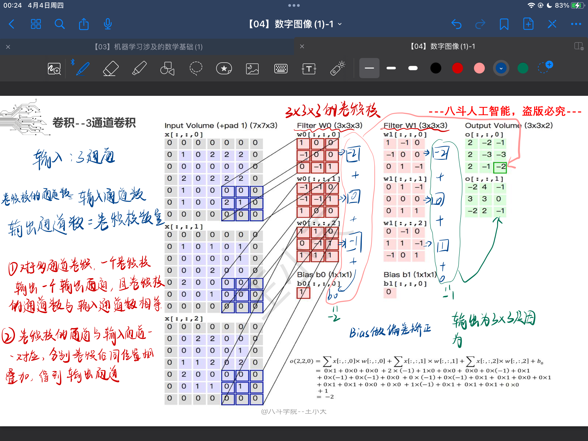

## 1.实现双线性插值
本质是重新计算新图中每个点的像素，注意理解几何中心对齐
````python
def function(img,size_w,size_h):
    width,height,channels = img.shape
    scale_x = float(width)/size_w
    scale_y = float(height)/size_h

    if width== size_w and height == size_h:
        return img

    dst_img = np.zeros((size_h,size_w,3),dtype=np.uint8)

    for channel in range(channels):
        for w in range(size_w):
            for h in range(size_h):
                #几何中心对齐
                src_x = (w+0.5) * scale_x - 0.5
                src_y = (h+0.5) * scale_y -0.5

                #得到点(x,y)
                src_x0 = int(np.floor(src_x))
                src_x1 = min(src_x0 +1,width-1) #边缘检测
                src_y0 = int(np.floor(src_y))
                src_y1 = min(src_y0+1,height-1)
                #得到4个相邻点 (x1,y0) (x1,y1) (x0,y1) (x0,y0)

                #矩阵[行（h）,列（w）]
                # ((x1-x)/x1-x0 )*f(x0,y0) + ((x-x0)/x1-x0) * f(x1,y0)
                temp0 = (src_x1 - src_x) * img[src_y0,src_x0,channel] + (src_x - src_x0) * img[src_y0,src_x1,channel]
                #((x1-x)/x1-x0) * f(x0,y1) + ((x-x0)/x1-x0) * f(x1,y1)
                temp1 = (src_x1-src_x) * img[src_y1,src_x0,channel] + (src_x - src_x0) * img[src_y1,src_x1,channel]
                #(y1-y)*temp0 + (y-y0)*temp1
                dst_img[h,w,channel] = int((src_y1-src_y) * temp0 + (src_y - src_y0) * temp1)

    return dst_img
````
## 2.实现直方图均衡化
作用是增强图像，直方图则反应了图像的特征。
````python
img = cv2.imread('lenna.png')
#灰度化
gray = cv2.cvtColor(img,cv2.COLOR_BGR2GRAY)

#均衡化前的直方图
#表示计算灰度图像 gray 的直方图，使用的通道是第 0 个通道（即灰度通道），直方图的大小为 256，像素值的范围为 0 到 255。
#None表示指定掩码图像，即不显示像素为xx的点，None就表示没有要掩盖的
# '''
# hist1 = cv2.calcHist([gray],[0],None,[256],[0,256])
# plt.figure()
# #dst.ravel() 将数组展平为一维数组，所有元素按行优先顺序排列成一个新的一维数组,256表示直方图的柱数
# plt.hist(hist1.ravel(),256)
# plt.show()
# '''

#直方图均衡化
dst = cv2.equalizeHist(gray)
hist2 = cv2.calcHist([dst],[0],None,[256],[0,256])
# 创建一个新的图形窗口
plt.figure()
#dst.ravel()展开后计算更快
plt.hist(dst.ravel(),256)
plt.show()

#图像对比
#使用 np.hstack() 函数水平堆叠两张图像
concatenated_img = np.hstack([gray,dst])
cv2.imshow("Histogram Equalization",concatenated_img)
cv2.waitKey(0)
cv2.destroyAllWindows()
````

## 3.实现sobel边缘检测
识别图像中亮度明暗变化明显的点，提取边缘部分
````python
img = cv2.imread('lenna.png',0)
# 等价于:
# original = cv2.imread('lenna.png') #默认为1：彩色读取
# img = cv2.cvtColor(original,cv2.COLOR_BGR2GRAY)

'''
# Sobel(src,ddepth,dx,dy,dst,ksize,scale,delta,borderType)
# 原图是unit8 无符号8位数
# cv2.CV_16S 防止阶段位数不够，使用有符号16位数
'''
x = cv2.Sobel(img,cv2.CV_16S,1,0)
y = cv2.Sobel(img,cv2.CV_16S,0,1)

'''
#在经过处理后，用convertScaleAbs()函数将其转回原来的uint8形式。
'''
abs_x = cv2.convertScaleAbs(x)
abs_y = cv2.convertScaleAbs(y)

'''
将两个方向组合起来
cv2.addWeighted(src1, alpha, src2, beta, gamma[, dst[, dtype]])  
其中alpha是第一幅图片中元素的权重，beta是第二个的权重，
gamma是加到最后结果上的一个值。
'''
result = cv2.addWeighted(abs_x,0.5,abs_y,0.5,0)
cv2.imshow("absX", abs_x)
cv2.imshow("absY", abs_y)
cv2.imshow("sobel result",result)
cv2.waitKey(0)

````

## 4.多通道进行卷积

